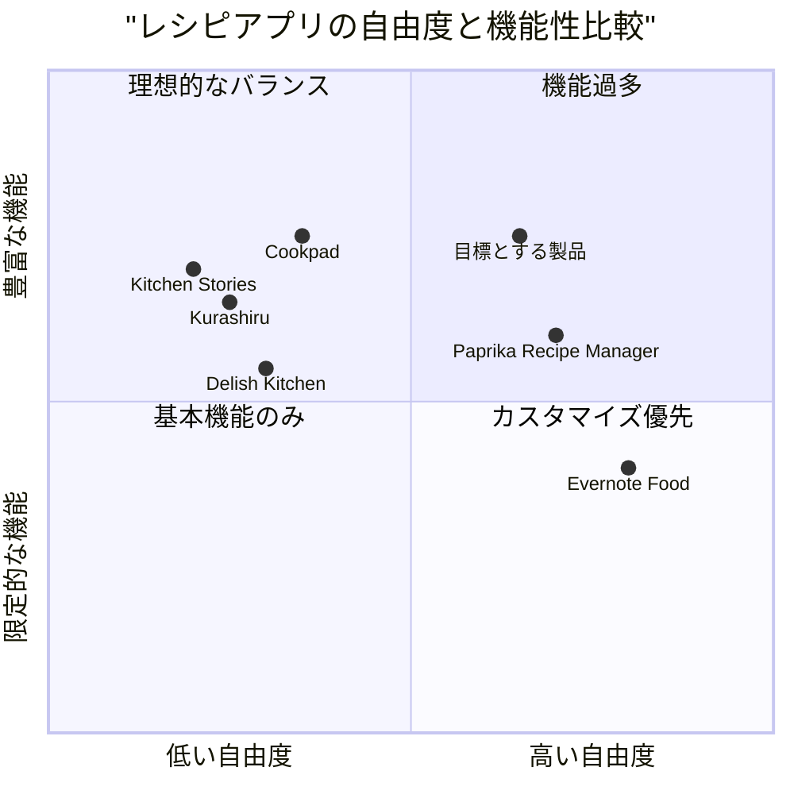

# 個人用レシピ管理アプリ PRD（製品要求仕様書）

## 1. プロジェクト概要

### 1.1 言語およびプロジェクト情報
- 言語: 日本語
- プログラミング言語: React, JavaScript, Tailwind CSS
- プロジェクト名: personal_recipe_app
- 元の要件: 自分の料理レシピを保存するためのアプリを作りたい。YouTubeの動画を参照してサムネイルに反映する機能も欲しい。別の料理アプリの設定を参考にして、モダンな設定やデザイン・入れた方が良さそうな要素があれば導入してほしい。

### 1.2 プロジェクトの背景
ユーザーは自分のレシピを一元管理し、YouTube動画と関連付けて保存したいと考えています。個人利用に特化し、複数デバイス（スマートフォン、タブレット、デスクトップ）での利用を想定しています。既存の料理アプリにある便利な機能やモダンなデザイン要素を取り入れることが求められています。

## 2. 製品定義

### 2.1 製品目標
1. ユーザーが自分のレシピを簡単かつ体系的に保存・管理できるアプリを提供する
2. YouTubeの料理動画とレシピを連携させ、視覚的な調理ガイドを実現する
3. 複数デバイスで一貫した使いやすいインターフェースを提供し、いつでもレシピにアクセスできるようにする

### 2.2 ユーザーストーリー
1. **レシピ管理**: 「料理愛好家として、自分のレシピを材料リストと共に保存したい。そうすることで、後で簡単に参照できるようになる」
2. **YouTube連携**: 「レシピ作成者として、参考にしたYouTube動画をレシピに関連付けたい。そうすることで、調理手順を視覚的に確認できる」
3. **クロスデバイス利用**: 「ユーザーとして、スーパーで買い物中にスマートフォンでレシピを確認し、自宅ではタブレットやPCで詳細を見たい。そうすることで、どこにいても必要な情報にアクセスできる」
4. **レシピ検索**: 「ユーザーとして、保存したレシピを材料や料理名で簡単に検索したい。そうすることで、必要な時に素早くレシピを見つけられる」

### 2.3 競合分析

#### 主要な競合アプリ分析

1. **Cookpad**
   - 長所: 膨大なレシピ数、コミュニティ機能、使いやすい検索機能
   - 短所: 個人レシピの管理機能が限定的、広告が多い、動画との連携が弱い

2. **Kurashiru**
   - 長所: 高品質な動画コンテンツ、視覚的なUI、ステップバイステップの説明
   - 短所: 自分のレシピ登録機能が少ない、動画が固定コンテンツのみ

3. **Delish Kitchen**
   - 長所: きれいなビジュアル、カテゴリ分類が優れている、レシピ保存機能
   - 短所: 自分のオリジナルレシピ管理機能がない、YouTube連携なし

4. **Paprika Recipe Manager**
   - 長所: クラウド同期、買い物リスト機能、カスタマイズ可能なカテゴリ
   - 短所: 有料アプリ、UI/UXが古い、動画連携機能が弱い

5. **Evernote Food**（サービス終了だが機能参考）
   - 長所: 柔軟なノート形式でのレシピ保存、タグ付け、検索機能
   - 短所: 料理に特化していない、構造化されていないデータ形式

6. **Kitchen Stories**
   - 長所: 美しいUI、ステップバイステップの写真付き説明、計量単位変換
   - 短所: 自作レシピの管理機能が弱い、コンテンツがアプリ提供のものに限られる

### 2.4 競合アプリの比較グラフ

## 3. 技術仕様

### 3.1 要件分析

本アプリは個人のレシピを管理し、YouTube動画と連携させることができるアプリです。ユーザーは自分だけの利用を想定しており、スマートフォン、タブレット、デスクトップといった複数のデバイスでの利用が求められています。以下に主要な技術要件を示します。

#### コアシステム要件
- クロスプラットフォーム対応（iOS、Android、Webアプリ）
- ローカルストレージとクラウドストレージの連携
- YouTube Data APIとの連携（動画情報の取得・サムネイル表示・再生）
- レスポンシブデザインによる複数画面サイズ対応
- オフライン機能（インターネット接続がなくてもレシピ閲覧可能）

### 3.2 要件プール

#### P0（必須実装）
1. **レシピの作成・編集機能**
   - タイトル、材料リスト、手順の記録
   - テキストエディタ（基本的なフォーマット機能付き）

2. **YouTube動画連携機能**
   - YouTube URLからの動画情報取得
   - サムネイル表示
   - アプリ内動画再生機能

3. **データ保存・同期機能**
   - ローカルストレージへの保存
   - クラウド同期（複数デバイス間）

4. **基本的な検索・フィルタリング機能**
   - キーワード検索
   - カテゴリによるフィルタリング

#### P1（重要だが必須ではない）
1. **レシピのカテゴリ/タグ管理**
   - カスタムカテゴリの作成
   - 複数タグの付与機能

2. **画像管理機能**
   - レシピへの複数画像添付
   - 画像のギャラリー表示

3. **材料の買い物リスト機能**
   - レシピから買い物リストを作成
   - チェックリスト形式での管理

4. **お気に入り/よく使うレシピの管理**
   - お気に入りマーキング
   - 最近使用したレシピの表示

#### P2（あると良い機能）
1. **調理タイマー機能**
   - 複数タイマーの同時使用
   - レシピステップとの連動

2. **栄養成分計算機能**
   - 材料から自動計算
   - 栄養バランスの可視化

3. **料理完成写真の記録機能**
   - 調理前後の比較
   - 時系列での管理

4. **料理のメモ/評価機能**
   - 調理のコツや改善点の記録
   - 自己評価システム

### 3.3 UIデザインドラフト

#### メイン画面（レシピ一覧）
- グリッドレイアウトでのレシピカードの表示
- 各カードにはタイトル、サムネイル画像（または関連YouTube動画のサムネイル）
- 上部に検索バーとフィルターオプション
- 右下にフローティングアクションボタン（+）で新規レシピ作成

#### レシピ詳細画面
- ヘッダー: レシピタイトル、お気に入りボタン、編集ボタン
- コンテンツエリア:
  - YouTube動画プレーヤー（サムネイル表示と再生機能）
  - 材料リスト（チェックボックス付き）
  - 調理手順（ステップ形式）
  - メモエリア
- フッター: カテゴリ/タグ情報、作成日時

#### レシピ編集画面
- フォーム形式のエディタ
- YouTube URL入力欄と動画プレビュー
- 材料追加機能（名前、量、単位）
- 手順追加機能（テキスト、オプションで画像）
- カテゴリ/タグ選択機能

### 3.4 オープンな質問

1. **YouTubeコンテンツポリシーの対応**
   - YouTube APIの利用制限やポリシー変更への対応方法
   - 埋め込み動画の著作権問題への対処

2. **データバックアップ/移行戦略**
   - 異なるデバイス間でのデータ移行の方法
   - クラウド同期の頻度とデータ整合性の保証

3. **オフライン機能の範囲**
   - YouTube動画のオフライン保存は可能か/法的制限
   - オフラインモードでの機能制限の明確化

4. **将来的な拡張可能性**
   - レシピ共有機能の追加可能性
   - 他の動画プラットフォーム（Vimeoなど）との連携

## 4. 開発ロードマップ

### フェーズ1: MVP（最小実行製品）開発
- 基本的なレシピ作成・保存機能
- シンプルなYouTube URL入力とサムネイル表示
- ローカルストレージでのデータ保存
- 基本的なUI/UXデザイン

### フェーズ2: 主要機能強化
- YouTube動画再生機能の実装
- クラウド同期機能の追加
- 検索・フィルタリング機能の強化
- レスポンシブデザインの最適化

### フェーズ3: 追加機能実装
- カテゴリ/タグシステムの実装
- 買い物リスト機能の追加
- UI/UX改善とアニメーション追加
- パフォーマンス最適化

## 5. まとめ

本PRDでは、ユーザーが自分の料理レシピを管理し、YouTube動画と連携できるアプリケーションの要件を定義しました。既存の料理アプリの分析を踏まえ、ユーザー中心の機能設計とモダンなUI/UXを提案しています。

主な特徴は以下の通りです：

1. 個人利用に特化したシンプルかつ効率的なレシピ管理
2. YouTubeの料理動画との連携（サムネイル表示・動画再生）
3. クロスプラットフォーム対応による複数デバイスでの利用
4. モダンで使いやすいインターフェース

優先度に基づく機能実装と段階的な開発アプローチにより、ユーザーに価値を提供しつつ、開発リソースを効率的に活用できるプロジェクト計画となっています。
